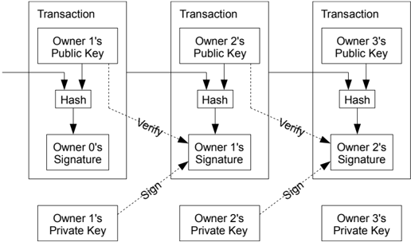
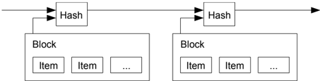
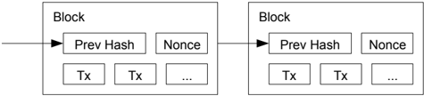
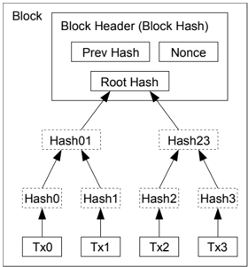
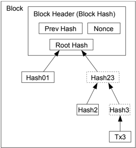
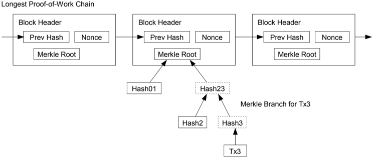
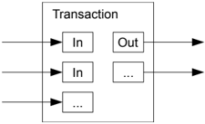
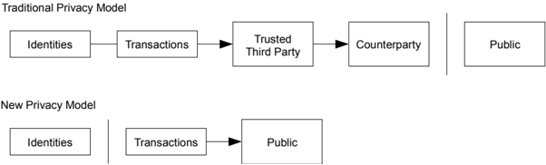

*Source: bitcoin.pdf — translated to Russian*

---

## Биткойн: Пиринговая Электронная Денежная Система

Сатоши Накамото satoshin@gmx.com www.bitcoin.org

Аннотация. Чисто пиринговая версия электронной наличности позволила бы отправлять онлайн-платежи напрямую от одной стороны к другой, минуя финансовые учреждения. Цифровые подписи предоставляют часть решения, но основные преимущества теряются, если все еще требуется доверенная третья сторона для предотвращения двойного расходования. Мы предлагаем решение проблемы двойного расходования, используя пиринговую сеть. Сеть временно помечает транзакции, хешируя их в непрерывной цепи на основе доказательства работы, формируя запись, которую нельзя изменить без повторного выполнения доказательства работы. Длиннейшая цепь служит не только доказательством последовательности событий, но и доказательством того, что она возникла из самого большого пула вычислительной мощности. Пока большинство вычислительной мощности контролируется узлами, которые не сотрудничают для атаки на сеть, они будут генерировать самую длинную цепь и опережать нападающих. Сама сеть требует минимальной структуры. Сообщения транслируются на основе наилучших усилий, и узлы могут выходить из сети и вновь присоединяться по своему желанию, принимая самую длинную цепь доказательства работы в качестве доказательства того, что произошло, пока они отсутствовали.

## 1. Введение

Торговля в Интернете практически полностью полагается на финансовые учреждения, служащие доверенными третьими сторонами для обработки электронных платежей. Хотя система работает достаточно хорошо для большинства транзакций, она все еще страдает от присущих слабостей модели, основанной на доверии. Полностью необратимые транзакции на самом деле невозможны, поскольку финансовые учреждения не могут избежать посредничества в спорах. Расходы на посредничество увеличивают транзакционные расходы, ограничивая минимальный практический размер транзакции и исключая возможность мелких случайных сделок, а также существует более широкий убыток в потере возможности производить необратимые платежи за необратимые услуги. С возможностью отмены необходимость в доверии распространяется. Торговцы должны быть осторожны с клиентами, требуя от них больше информации, чем им было бы необходимо. Определенный процент мошенничества принимается как неизбежный. Эти расходы и неопределенности в платежах могут быть избегнуты при личной встрече с использованием наличной валюты, но не существует механизма для совершения платежей через коммуникативный канал без доверенной стороны.

Необходимо создать электронную платежную систему, основанную на криптографическом доказательстве, а не на доверии, позволяющую любым двум желающим сторонам осуществлять транзакции напрямую друг с другом без необходимости в доверенной третьей стороне. Транзакции, которые вычислительно невозможно отменить, защитят продавцов от мошенничества, и рутинные механизмы эскроу могут быть легко реализованы для защиты покупателей. В этой статье мы предлагаем решение проблемы двойного расходования с использованием распределенного сервера временных меток, чтобы генерировать вычислительное доказательство хронологического порядка транзакций. Система является безопасной, пока честные узлы коллективно контролируют больше вычислительной мощности, чем любая сотрудничающая группа атакующих узлов.

## 2. Транзакции

Мы определяем электронную монету как цепочку цифровых подписей. Каждый владелец передает монету следующему, цифрово подписывая хеш предыдущей транзакции и открытый ключ следующего владельца и добавляя их в конец монеты. Получатель может проверить подписи, чтобы подтвердить цепочку владения.



Проблема, конечно же, заключается в том, что получатель не может подтвердить, что один из владельцев не потратил монету дважды. Общим решением является введение доверительного центрального органа или монетного двора, который проверяет каждую транзакцию на предмет двойных трат. После каждой транзакции монета должна быть возвращена в монетный двор для выпуска новой монеты, и только монеты, выпущенные непосредственно из монетного двора, считаются надежными и не подлежат двойной трате. Проблема с этим решением заключается в том, что судьба всей денежной системы зависит от компании, управляющей монетным двором, при этом каждая транзакция должна проходить через них, как в банке.

Нам нужен способ для получателя знать, что предыдущие владельцы не подписали никаких более ранних транзакций. Для наших целей самой ранней транзакцией считается та, которая имеет значение, поэтому нас не волнуют более поздние попытки двойной траты. Единственный способ подтвердить отсутствие транзакции — знать о всех транзакциях. В модели на основе монетного двора монетный двор знал о всех транзакциях и решал, какие пришли первыми. Чтобы достичь этого без доверенной стороны, транзакции должны быть публично объявлены [1], и нам нужна система, позволяющая участникам согласиться на единую историю порядка их получения. Получателю необходимо доказательство того, что на момент каждой транзакции большинство узлов согласилось, что это была первая полученная транзакция.

## 3. Сервер временных меток

Решение, которое мы предлагаем, начинается с сервера временных меток. Сервер временных меток работает, принимая хеш блока элементов, которые необходимо пометить временной меткой, и широко публикуя этот хеш, например, в газете или публикации в Usenet [2-5]. Временная метка доказывает, что данные, очевидно, должны были существовать в это время, чтобы попасть в хеш. Каждая временная метка включает предыдущую временную метку в свой хеш, формируя цепочку, при этом каждая дополнительная временная метка усиливает предыдущие. 



## 4. Доказательство работы

Чтобы реализовать распределенный сервер временных меток на основе пиринговой сети, нам потребуется использовать систему доказательства работы, аналогичную Hashcash Адама Бэка [6], а не сообщениям в газетах или Usenet. Доказательство работы включает в себя поиск значения, которое при хешировании, например, с помощью SHA-256, дает хеш, начинающийся с определенного количества нулевых битов. Средняя работа, необходимая для этого, экспоненциальна по отношению к количеству требуемых нулевых битов и может быть проверена, выполняя единственное хеширование.

Для нашей сети временных меток мы реализуем доказательство работы, инкрементируя nonce в блоке до тех пор, пока не будет найдено значение, которое даст хеш блока с необходимым количеством нулевых битов. Как только вычислительные усилия CPU будут истрачены на выполнение доказательства работы, блок не может быть изменен без повторного выполнения работы. Поскольку последующие блоки связываются с ним, работа по изменению блока будет включать повторное выполнение всех блоков после него.



Доказательство работы также решает проблему определения представительства в принятии решений большинством. Если большинство основывалось бы на принципе один IP-адрес — один голос, его могли бы подорвать любые, кто способен распределить множество IP-адресов. Доказательство работы по сути является принципом один CPU — один голос. Решение большинства представлено самой длинной цепочкой, в которую было вложено наибольшее количество усилий доказательства работы. Если большинство вычислительной мощности контролируется честными узлами, честная цепочка будет расти быстрее и обгонит любые конкурентные цепочки. Чтобы модифицировать прошлый блок, злоумышленник должен повторно выполнить доказательство работы блока и всех последующих блоков, а затем догнать и превзойти работу честных узлов. Мы позже покажем, что вероятность того, что медленный злоумышленник сможет догнать, уменьшается экспоненциально с добавлением последующих блоков.

Для компенсации увеличения скорости аппаратного обеспечения и изменения интереса к запуску узлов со временем, сложность доказательства работы определяется подвижной средней, нацеленной на среднее количество блоков в час. Если они генерируются слишком быстро, сложность увеличивается.

## 5. Сеть

Шаги для запуска сети следующие:

- 1) Новые транзакции расп broadcasts to all nodes.
- 2) Каждый узел собирает новые транзакции в блок.
- 3) Каждый узел работает над поиском сложного доказательства работы для своего блока.
- 4) Когда узел находит доказательство работы, он рассылает блок всем узлам.
- 5) Узлы принимают блок только в том случае, если все транзакции в нем действительны и не были ранее использованы.
- 6) Узлы выражают свое согласие с блоком, работая над созданием следующего блока в цепочке, используя хеш принятого блока как предыдущий хеш.

Узлы всегда считают самой длинной цепью правильную и будут продолжать работать над ее расширением. Если два узла одновременно рассылают разные версии следующего блока, некоторые узлы могут сначала получить одну или другую. В этом случае они работают с первой, которую получили, но сохраняют другую ветвь в случае, если она станет длиннее. Ничья будет разрешена, когда будет найдено следующее доказательство работы и одна из ветвей станет длиннее; узлы, которые работали над другой ветвью, затем переключатся на более длинную.

Рассылки новых транзакций не обязательно должны достигать всех узлов. Пока они достигают множества узлов, они скоро попадут в блок. Рассылки блоков также устойчivé к потерянным сообщениям. Если узел не получает блок, он запросит его, когда получит следующий блок и осознает, что пропустил один.

## 6. Стимул

По соглашению, первая транзакция в блоке является специальной транзакцией, которая инициирует новую монету, принадлежащую создателю блока. Это добавляет стимул для узлов поддерживать сеть и предоставляет способ первоначального распределения монет в обращение, поскольку нет центрального органа, который мог бы их выпустить. Постоянное добавление фиксированного количества новых монет аналогично затрате ресурсов золотоискателями для добавления золота в обращение. В нашем случае это затраты времени процессора и электроэнергии.

Стимул также может финансироваться за счет транзакционных сборов. Если выходное значение транзакции меньше ее входного значения, разница является транзакционным сбором, который добавляется к стимульному значению блока, содержащего транзакцию. После того как определенное количество монет войдет в обращение, стимул может полностью перейти на транзакционные сборы и быть абсолютно свободным от инфляции.

Стимул может помочь мотивировать узлы оставаться честными. Если жадный атакующий сможет собрать больше вычислительной мощности, чем все честные узлы, ему придется выбирать между использованием этой мощности для обмана людей, возвращая свои платежи, или использованием ее для генерации новых монет. Ему должно быть более выгодно играть по правилам, такие правила, которые позволяют ему получать больше новых монет, чем у всех остальных в совокупности, чем подрывать систему и легитимность своего собственного богатства.

## 7. Восстановление дискового пространства

Как только последняя транзакция в монете будет похоронена под достаточным количеством блоков, потраченные транзакции до нее могут бытьdiscarded для экономии дискового пространства. Чтобы облегчить это, не нарушая хеш блока, транзакции хешируются в дереве Меркла [7][2][5], при этом в хеш блока включается только корень. Старые блоки могут быть сжаты, обрезая ветви дерева. Внутренние хеши не нужно хранить.

Транзакции, хешированные в дереве Меркла



После обрезки Tx0-2 из блока



Заголовок блока без транзакций будет занимать около 80 байт. Если предположить, что блоки генерируются каждые 10 минут, 80 байт * 6 * 24 * 365 = 4.2MB в год. С учетом того, что компьютерные системы обычно продаются с 2 ГБ ОЗУ с 2008 года, и закон Мура прогнозирует рост ОЗУ на 1,2 ГБ в год, проблема хранения не должна возникнуть, даже если заголовки блоков необходимо хранить в памяти.

## 8. Упрощенная проверка платежей

Можно проверить платежи, не запуская полный узел сети. Пользователю нужно лишь сохранить копию заголовков блоков самой длинной цепочки доказательства работы, которую он может получить, запрашивая узлы сети, пока не убедится, что у него самая длинная цепочка, и получить ветвь Меркла, связывающую транзакцию с блоком, в котором она временно отмечена. Он не может сам проверить транзакцию, но, связывая ее с местом в цепочке, он может видеть, что узел сети принял ее, и блоки, добавленные после нее, дополнительно подтверждают, что сеть приняла ее.



Таким образом, проверка надежна, пока честные узлы контролируют сеть, но более уязвима, если сеть подавляется атакующим. Хотя узлы сети могут проверять транзакции самостоятельно, упрощенный метод может быть обманут фальсифицированными транзакциями атакующего, пока атакующий может продолжать подавлять сеть. Одна из стратегий защиты от этого может заключаться в том, чтобы принимать оповещения от узлов сети, когда они обнаруживают недействительный блок, побуждая программное обеспечение пользователя загрузить полный блок и оповещенные транзакции для подтверждения несоответствия. Бизнесы, которые получают частые платежи, вероятно, все равно захотят запустить свои собственные узлы для большей независимой безопасности и более быстрой проверки.

## 9. Объединение и Разделение Значений

Хотя было бы возможно обрабатывать монеты по отдельности, было бы неудобно делать отдельную транзакцию для каждого цента в переводе. Чтобы позволить разделить и объединить значения, транзакции содержат несколько входов и выходов. Обычно будет либо один вход из более крупной предыдущей транзакции, либо несколько входов, объединяющих меньшие суммы, и не более двух выходов: один для платежа, и один возвращающий сдачу, если такая имеется, обратно отправителю.



Следует отметить, что расширение, когда транзакция зависит от нескольких транзакций, а эти транзакции зависят от многих других, не является здесь проблемой. Никогда не возникает необходимости извлекать полную самостоятельную копию истории транзакции.

## 10. Конфиденциальность

Традиционная банковская модель достигает определенного уровня конфиденциальности, ограничивая доступ к информации сторонами, участвующими в сделке, и доверенным третьим лицом. Необходимость публично анонсировать все транзакции исключает этот метод, но конфиденциальность все еще может быть сохранена, если разбить поток информации в другом месте: сохраняя публичные ключи анонимными. Общественность может видеть, что кто-то отправляет сумму кому-то другому, но без информации, связывающей транзакцию с кем-либо. Это похоже на уровень информации, раскрываемой фондовыми биржами, где время и размер отдельных сделок, "лента", становятся известны, но без указания, кто были стороны.



В качестве дополнительного уровня защиты для каждой транзакции должен использоваться новый ключевой комплект, чтобы их нельзя было связать с общим владельцем. Некоторая связь все же неизбежна с транзакциями с несколькими входами, которые неизбежно раскрывают, что их входы принадлежали одному и тому же владельцу. Риск заключается в том, что если владелец ключа будет раскрыт, соединение может раскрыть другие транзакции, принадлежащие тому же владельцу.

## 11. Расчёты

Мы рассматриваем сценарий атаки, при котором злоумышленник пытается сгенерировать альтернативную цепочку быстрее, чем честная цепочка. Даже если это удастся, это не откроет систему для произвольных изменений, таких как создание ценности из воздуха или присвоение денег, которые никогда не принадлежали злоумышленнику. Узлы не будут принимать недействительную транзакцию в качестве оплаты, и честные узлы никогда не примут блок, содержащий их. Злоумышленник может только попытаться изменить одну из своих собственных транзакций, чтобы вернуть деньги, которые он недавно потратил.

Соревнование между честной цепочкой и цепочкой злоумышленника можно охарактеризовать как биномиальную случайную прогулку. Успехом считается расширение честной цепочки на один блок, что увеличивает её преимущество на +1, а неудачей – расширение цепочки злоумышленника на один блок, что уменьшает разрыв на -1.

Вероятность того, что злоумышленник догонист пользователю от заданного дефицита, аналогична задаче о разорении гамблера. Предположим, что азартный игрок с неограниченным кредитом начинает с дефицитом и играет потенциально бесконечное число попыток, чтобы попытаться достичь безубыточности. Мы можем вычислить вероятность того, что он когда-либо достигнет безубыточности, или что злоумышленник когда-либо догонит честную цепочку, следующим образом [8]:

p = вероятность того, что честный узел найдет следующий блок

q = вероятность того, что злоумышленник найдет следующий блок

q z = вероятность того, что злоумышленник когда-либо догонит с z блоков отставания

<!-- formula-not-decoded -->

Учитывая наше предположение, что p &gt; q, вероятность уменьшается экспоненциально, по мере роста количества блоков, которые злоумышленнику нужно догнать. С шансами против него, если он не сделает удачное продвижение вперёд в начале, его шансы становятся ничтожными, поскольку он отстаёт всё больше.

Теперь мы рассмотрим, как долго получателю новой транзакции нужно ждать, прежде чем он будет достаточно уверен, что отправитель не может изменить транзакцию. Мы предполагаем, что отправитель - это злоумышленник, который хочет заставить получателя поверить, что он заплатил ему, а затем переключить это, чтобы вернуть деньги себе после того, как пройдет некоторое время. Получатель будет предупреждён, когда это произойдет, но отправитель надеется, что это будет слишком поздно.

Получатель генерирует новую пару ключей и передаёт открытый ключ отправителю незадолго до подписания. Это предотвращает подготовку отправителем цепочки блоков заранее, работая над ней непрерывно, пока ему не повезёт получить достаточно большой отрыв, а затем выполнить транзакцию в этот момент. Как только транзакция отправлена, нечестный отправитель начинает втайне работать над параллельной цепочкой, содержащей альтернативную версию его транзакции.

Получатель ждёт, пока транзакция не будет добавлена в блок и z блоков не будут связаны после него. Он не знает точного количества прогресса, который сделал злоумышленник, но предполагая, что честные блоки заняли среднее ожидаемое время на блок, потенциальный прогресс злоумышленника будет распределением Пуассона с ожидаемым значением:

<!-- formula-not-decoded -->

Чтобы получить вероятность того, что злоумышленник всё ещё может догнать сейчас, мы умножаем плотность Пуассона для каждого количества прогресса, который он мог сделать, на вероятность того, что он может догнать с той точки:

<!-- formula-not-decoded -->

Переставляя, чтобы избежать суммирования бесконечного хвоста распределения...

<!-- formula-not-decoded -->

Преобразование в код на C...

```
#include <math.h> double AttackerSuccessProbability(double q, int z) { double p = 1.0 - q; double lambda = z * (q / p); double sum = 1.0; int i, k; for (k = 0; k <= z; k++) { double poisson = exp(-lambda); for (i = 1; i <= k; i++) poisson *= lambda / i; sum -= poisson * (1 - pow(q / p, z - k)); } return sum; }
```

Запуская некоторые результаты, мы можем видеть, как вероятность экспоненциально падает с увеличением z.

```
q=0.1 z=0    P=1.0000000 z=1    P=0.2045873 z=2    P=0.0509779 z=3    P=0.0131722 z=4    P=0.0034552 z=5    P=0.0009137 z=6    P=0.0002428 z=7    P=0.0000647 z=8    P=0.0000173 z=9    P=0.0000046 z=10   P=0.0000012 q=0.3 z=0    P=1.0000000 z=5    P=0.1773523 z=10   P=0.0416605 z=15   P=0.0101008 z=20   P=0.0024804 z=25   P=0.0006132 z=30   P=0.0001522 z=35   P=0.0000379 z=40   P=0.0000095 z=45   P=0.0000024 z=50   P=0.0000006
```

## Решение для P меньше 0.1%...

```
P < 0.001 q=0.10   z=5 q=0.15   z=8 q=0.20   z=11 q=0.25   z=15 q=0.30   z=24 q=0.35   z=41 q=0.40   z=89 q=0.45   z=340
```

## 12. Заключение

Мы предложили систему для электронных транзакций без полагания на доверие. Мы начали с обычной структуры монет, сделанных из цифровых подписей, которая обеспечивает сильный контроль над собственностью, но недостаточна без способа предотвращения двойных трат. Чтобы решить эту задачу, мы предложили одноранговую сеть, использующую доказательство работы для записи публичной истории транзакций, которая быстро становится вычислительно непрактичной для атакующего, если честные узлы контролируют большинство вычислительной мощности. Сеть устойчива в своей неструктурированной простоте. Узлы работают одновременно с минимальной координацией. Им не нужно быть идентифицированными, поскольку сообщения не направляются в какое-то конкретное место и должны доставляться на основании наилучших усилий. Узлы могут покидать и вновь присоединяться к сети по своему желанию, принимая цепочку доказательства работы как подтверждение того, что произошло, пока их не было. Они голосуют своей вычислительной мощностью, выражая своё согласие с действительными блоками, работая над их расширением, и отвергая недействительные блоки, отказываясь работать с ними. Любые необходимые правила и стимулы могут быть обеспечены с помощью этого механизма консенсуса.

## Ссылки

- [1] W. Dai, "b-money," http://www.weidai.com/bmoney.txt, 1998.
- [2] H. Massias, X.S. Avila, and J.-J. Quisquater, "Дизайн безопасного сервиса для создания временных меток с минимальными требованиями к доверию," В 20-м Симпозиуме по теории информации в Бенилюксе, май 1999.
- [3] S. Haber, W.S. Stornetta, "Как сделать временную метку для цифрового документа," В Журнале криптологии, том 3, № 2, страницы 99-111, 1991.
- [4] D. Bayer, S. Haber, W.S. Stornetta, "Улучшение эффективности и надежности цифровой временной метки," В Sequences II: Методы в коммуникациях, безопасности и компьютерных науках, страницы 329-334, 1993.
- [5] S. Haber, W.S. Stornetta, "Безопасные имена для битовых строк," В Трудах 4-й конференции ACM по безопасности компьютерных и коммуникационных систем, страницы 28-35, апрель 1997.
- [6] A. Back, "Hashcash - мера противодействия отказу в обслуживании," http://www.hashcash.org/papers/hashcash.pdf, 2002.
- [7] R.C. Merkle, "Протоколы для криптосистем с открытым ключом," В Трудах Симпозиума по безопасности и конфиденциальности 1980 года, IEEE Computer Society, страницы 122-133, апрель 1980.
- [8] W. Feller, "Введение в теорию вероятностей и её приложения," 1957.