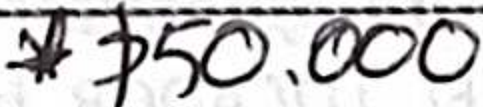
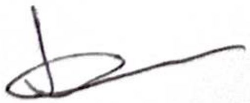
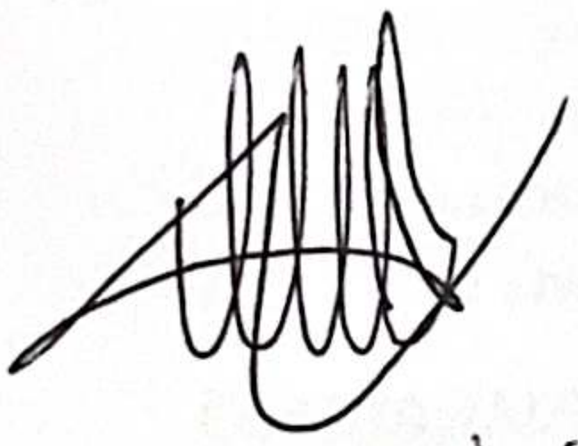
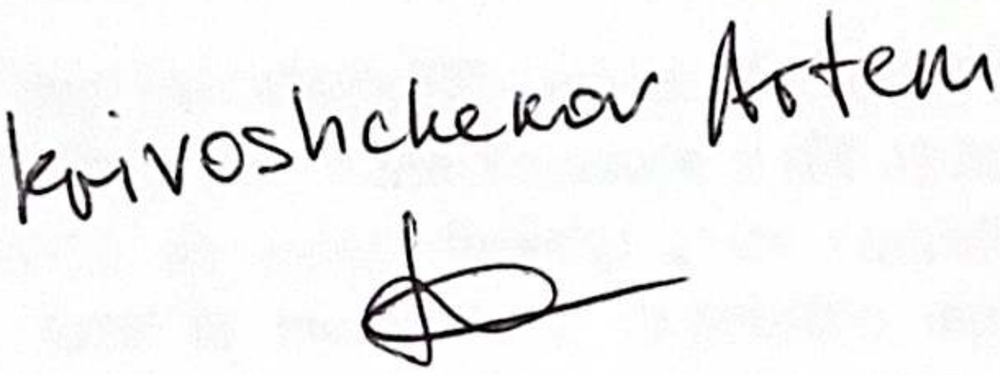

*Source: Rent Santa Fe.pdf — translated to Russian*

---

## ДОГОВОР АРЕНДЫ С ОСОБЫМИ ЦЕЛЯМИ

Между госпожой КОЛУМБАНОЙ АЛИЦИЕЙ ЭСТЕЛОЙ, DNI Н° F6.264.616, гражданкой АРГЕНТИНЫ, которая для целей этого контракта устанавливает место нахождения по адресу улица АЯКУЧО N890 PB "B" ГОРОД АВТОНОМНАЯ БУЭНОС-АЙРЕС, в дальнейшем "АРЕНДАТОР", и госпожой КОНДРАТЮК ЕЛЕНОЙ, ПАСПОРТ N757104470, и господином КРИВОШЕЧЕВЫМ АРТЕМОМ, ПАСПОРТ N755952366, оба граждане РОССИИ, которые для целей этого договора устанавливают место нахождения в арендуемом помещении, заключают этот ДОГОВОР АРЕНДЫ ЖИЛЬЯ С ОСОБЫМИ ЦЕЛЯМИ, который подлежит следующим пунктам:

ПЕРВЫЙ (ПРЕДМЕТ): АРЕНДОДАТЕЛЬ предоставляет в аренду АРЕНДАТОРУ, земельный участок своей собственности, расположенный по адресу авеню САНТА-ФЕ N°2069 ЭТАЖ 12 КВАРТИРА "А" ГОРОД АВТОНОМНАЯ БУЭНОС-АЙРЕС, в дальнейшем АРЕНДУЕМОЕ ПОМЕЩЕНИЕ.--

ТРЕТИЙ (СРОК): Срок действия ДОГОВОРА составляет ТРИ МЕСЯЦА (3), начиная с 23 МАРТА 2024 года, и заканчивается 23 ИЮНЯ 2024 года. Срок истечет по окончанию полномочий и без необходимости какого-либо уведомления или извещения. В случае задержки возврата АРЕНДУЕМОГО ПОМЕЩЕНИЯ по окончании ДОГОВОРА, АРЕНДАТОР выплачивает штрафную неустойку в размере ДЕСЯТИ ТЫСЯЧ ПЕСО АРГЕНТИНЫХ (ARS 10.000.-). Является выраженной записью, что срок, даже превышая ТРИ месяца, был согласован в соответствии с положениями ст. 1199 п. b, Гражданского и Торгового Кодекса.--

ЧЕТВЕРТЫЙ (АРЕНДНАЯ ПЛАТА): 1. Арендная плата на протяжении всего срока аренды составит ДОПЛАТА, подписываю эту договор, служа в качестве единственного и достаточного чека.--

ПЯТЫЙ (РАСХОДЫ, УСЛУГИ И НАЛОГИ): 1. АРЕНДАТОР берет на себя оплату ИНТЕРНЕТА Wi-Fi, РАСХОДОВ (с верхним пределом в $50.000) и ЭЛЕКТРИЧЕСТВА и ГАЗА (сумма, превышающая установленный ANSES и РАСХОДЫ на сумму, превышающую указанный потолок в $30.000, упомянутом в пункте

ШЕСТОЙ: Настоящим договором арендатор предоставляет доступ к помещению арендодателю с предварительным уведомлением, если необходимо провести осмотр помещений или выполнять любые необходимые ремонты.

СЕДЬМОЙ: Помещение передается с мебелью, окнами, предметами обстановки, санитарными установками, покраской и бытовыми приборами в идеальных условиях эксплуатации и функционирования, как указано в приложении инвентаря. АРЕНДАТОР обязуется вернуть его в том же состоянии, в каком он его получил, начиная с даты, когда он занимает собственность, включая санитарные, электрические и другие элементы, находящиеся в этом помещении. АРЕНДАТОР не может вносить никаких изменений в помещение без письменного разрешения АРЕНДОДАТЕЛЯ и обязан восстановить прежнее состояние по окончании аренды; в этом случае будет произведен осмотр помещения, а также.

также мебели, при этом АРЕНДАТОР обязан компенсировать недостающее или возместить по текущей рыночной цене.--

ВОСЬМОЙ (УЛУЧШЕНИЯ И ИЗМЕНЕНИЯ): АРЕНДАТОР не может вносить изменения в АРЕНДУЕМОЕ ПОМЕЩЕНИЕ, если он не имеет на это явного разрешения АРЕНДОДАТЕЛЯ. Все улучшения, сделанные с согласия последнего, остаются в благо АРЕНДОДАТЕЛЯ без права на какую-либо компенсацию.

ДЕВЯТЫЙ (ЗАПРЕТЫ): 1. АРЕНДАТОР не может сублизовать АРЕНДУЕМОЕ ПОМЕЩЕНИЕ или передавать аренду или передавать третьим лицам владение имуществом на любое основание. 2. Он также не может использовать его для целей, отличных от своей жилой семьи. --

Состояние помещения хорошее, с хорошим состоянием сохранности и чистоты, все двери, полы, окна, кухня, стекла, фурнитура, сантехника в очень хорошем состоянии. АРЕНДАТОР будет поддерживать АРЕНДУЕМОЕ ПОМЕЩЕНИЕ и возвратит его в том же состоянии, в каком получил, за исключением износа, вызванного действием времени. 2. АРЕНДОДАТЕЛЬ передает АРЕНДУЕМОЕ ПОМЕЩЕНИЕ в хорошем состоянии и работе, и он не отвечают за ухудшение качества или дефекты, вызванные любой причиной, не относящейся к подробному описанию в приложенном документе (приложение I), который является неотъемлемой частью настоящего документа. 3. АРЕНДОДАТЕЛЬ не несет ответственность за ущерб, причиненный АРЕНДАТОРУ или третьим лицам в результате несчастного случая, форс-мажора, пожара, наводнения или другого происшествия, а также за ущерб, который может возникнуть из-за необходимых работ по поддержанию помещения. 4. АРЕНДАТОР также не несет ответственности за ущерб или убытки по причине форс-мажора, халатности соседей или с письменного документа, полученного от АРЕНДОДАТЕЛЯ, другие доказательства не принимаются. Если АРЕНДАТОР покинет АРЕНДУЕМОЕ ПОМЕЩЕНИЕ или передаст ключи в суд ненадлежащим образом, он будет обязан произвести оплату аренды и пени до дня, когда суд вернет владение АРЕНДУЕМОГО ПОМЕЩЕНИЯ АРЕНДОДАТЕЛЮ, оставаясь при этом права последнего требовать исполнения контракта.

в случае задолженности, АРЕНДАТОР передает в депозит АРЕНДОДАТЕЛЮ сумму в размере ПЯТЬСОТ ДОЛЛАРОВ США (USD 500.-), что служит достаточным чеком. 2. При возврате АРЕНДУЕМОГО ПОМЕЩЕНИЯ АРЕНДОДАТЕЛЬ вернет АРЕНДАТОРУ этот гарантийный депозит в той же валюте и виде, в котором он был получен. 3. Если АРЕНДАТОР не подтвердит оплату коммунальных услуг на момент возврата АРЕНДУЕМОГО ПОМЕЩЕНИЯ, АРЕНДОДАТЕЛЬ может удержать из этого гарантийного депозита необходимую сумму для погашения таких долгов. Аналогично, депозит может быть применен для компенсации какого-либо ущерба, понесенного помещением или его установками, после предоставления АРЕНДАТОРУ соответствующего сметы.

ДЕСЯТАЯ ВТОРАЯ (ДОСРОЧНОЕ РАСТОРЖЕНИЕ): По истечении ДВУХ (2) месяцев действия этого договора АРЕНДАТОР может запросить досрочное расторжение. В этом случае он должен уведомить АРЕНДОДАТЕЛЯ за ТРИ месяца заранее, что является условием "sine qua non" для требования возврата гарантийного депозита.

юрисдикция, устанавливая специальные адреса, указанные в заголовке. Гражданский и Торговый процесс Национальной Республики для любого судебного дела, которое АРЕНДОДАТЕЛЬ может инициировать против АРЕНДАТОРА по взысканию денежных сумм за аренду, штрафы, пени, услуги, страхование, ущерб и/или по любой другой сумме, которая может возникнуть из-за ненадлежащего исполнения настоящего договора.--

ДЕВЯТАЯ ПЯТАЯ (МЕСТО И ДАТА): По взаимному согласию подписаны два идентичных экземпляра для единой цели в Автономном городе Буэнос-Айрес, 23 числа месяца МАРТА 2024 года.--

kevivoshcherovArten

ManiAlwiA.V.

